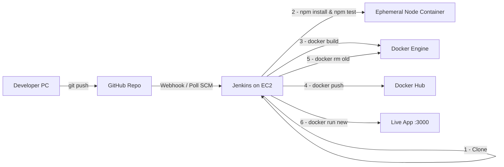

# Complete AWS Ubuntu Deployment Guide — Jenkins Pipeline & Docker

> Every single step to deploy the **jenkins-devops** Node.js/Express app onto an **AWS EC2 Ubuntu** instance using **Jenkins Pipelines** and **Docker**.

---

## Architecture Diagram



---

## Pipeline Stages Breakdown

Your [Jenkinsfile](file:///Users/gcm/Downloads/jenkins-devops/Jenkinsfile) defines these stages:

| # | Stage | What it does |
|---|-------|-------------|
| 1 | Clone Code | Clones `main` branch from GitHub |
| 2 | Install Dependencies & Run Tests | Runs `npm install && npm test` inside a throwaway `node:22-alpine` container |
| 3 | Build Docker Image | Builds image `chandu9000/jenkins_devops:latest` |
| 4 | Docker Login | Logs into Docker Hub using Jenkins credential `jenkins-project` |
| 5 | Push Docker Image | Pushes the image to Docker Hub |
| 6 | Stop Old Container | Removes existing container `jenkins_devops_container` (if any) |
| 7 | Run New Container | Starts a new container on port `3000` |
| 8 | Verify Deployment | Runs `docker ps` to confirm |

---

## PART A — Fix Your Code Before Deploying

> [!CAUTION]
> Your [Dockerfile](file:///Users/gcm/Downloads/jenkins-devops/Dockerfile#L13) runs `CMD ["npm", "start"]`, but your [package.json](file:///Users/gcm/Downloads/jenkins-devops/package.json) has **no `start` script**. The container will crash immediately. Fix this first.

### Step A.1 — Add the `start` script to package.json

Open [package.json](file:///Users/gcm/Downloads/jenkins-devops/package.json) and change:

```diff
   "scripts": {
-    "test": "jest"
+    "test": "jest",
+    "start": "node index.js"
   },
```

### Step A.2 — Commit and push to GitHub

```bash
cd /path/to/jenkins-devops
git add package.json
git commit -m "fix: add start script for Docker"
git push origin main
```

---

## PART B — Launch an AWS EC2 Ubuntu Instance

### Step B.1 — Log in to AWS Console
1. Go to [https://console.aws.amazon.com](https://console.aws.amazon.com)
2. Sign in with your AWS account credentials.

### Step B.2 — Navigate to EC2
1. In the top search bar, type **EC2** and click on **EC2** under Services.
2. Click the orange **Launch instance** button.

### Step B.3 — Configure the instance

| Setting | Value |
|---------|-------|
| **Name** | `jenkins-docker-server` |
| **AMI** | Ubuntu Server 24.04 LTS (HVM), SSD Volume Type — 64-bit (x86) |
| **Instance type** | `t2.medium` (recommended) or `t2.micro` (free tier — may be slow) |
| **Key pair** | Click **Create new key pair** → Name it `jenkins-key` → Type: RSA → Format: `.pem` → Click **Create** → The file `jenkins-key.pem` downloads automatically |
| **Storage** | Change from 8 GiB to **20 GiB** gp3 (Jenkins + Docker images need space) |

### Step B.4 — Configure Security Group (Firewall Rules)
Under **Network settings**, click **Edit** and add these **Inbound Rules**:

| Type | Protocol | Port Range | Source | Why |
|------|----------|-----------|--------|-----|
| SSH | TCP | `22` | My IP | SSH into the server |
| Custom TCP | TCP | `8080` | `0.0.0.0/0` (Anywhere) | Access Jenkins Web UI |
| Custom TCP | TCP | `3000` | `0.0.0.0/0` (Anywhere) | Access the deployed Node.js app |

### Step B.5 — Launch the instance
1. Click **Launch instance**.
2. Click **View all instances**.
3. Wait until the **Instance state** column shows **Running** and **Status check** shows **2/2 checks passed**.
4. Click on your instance and **copy the Public IPv4 address** (e.g., `3.110.45.67`). You'll use this everywhere below.

---

## PART C — Connect to the Server via SSH

### Step C.1 — Open your local terminal (Mac/Linux)

```bash
cd ~/Downloads
```

### Step C.2 — Set correct permissions on the key file

```bash
chmod 400 jenkins-key.pem
```

### Step C.3 — SSH into the EC2 instance

```bash
ssh -i "jenkins-key.pem" ubuntu@<YOUR-EC2-PUBLIC-IP>
```

Replace `<YOUR-EC2-PUBLIC-IP>` with the IP you copied (e.g., `3.110.45.67`).

**Expected output:**
```
Welcome to Ubuntu 24.04 LTS ...
ubuntu@ip-172-31-XX-XX:~$
```

> [!TIP]
> If you get a "Connection timed out" error, double-check that your Security Group allows SSH (port 22) from your current IP address.

---

## PART D — Install Docker on Ubuntu EC2

Run the following commands **one by one** on the EC2 instance.

### Step D.1 — Update system packages

```bash
sudo apt update
```

```bash
sudo apt upgrade -y
```

### Step D.2 — Install Docker using the official convenience script

```bash
curl -fsSL https://get.docker.com -o get-docker.sh
```

```bash
sudo sh get-docker.sh
```

### Step D.3 — Verify Docker is installed and running

```bash
sudo systemctl status docker
```

**Expected output (look for "active (running)"):**
```
● docker.service - Docker Application Container Engine
     Loaded: loaded
     Active: active (running) since ...
```

Press `q` to exit.

### Step D.4 — Allow the `ubuntu` user to run Docker without `sudo`

```bash
sudo usermod -aG docker ubuntu
```

### Step D.5 — Apply the group change

> [!IMPORTANT]
> You MUST log out and log back in for the group change to take effect.

```bash
exit
```

Then reconnect:

```bash
ssh -i "jenkins-key.pem" ubuntu@<YOUR-EC2-PUBLIC-IP>
```

### Step D.6 — Confirm Docker works without `sudo`

```bash
docker run hello-world
```

**Expected output:**
```
Hello from Docker!
This message shows that your installation appears to be working correctly.
```

---

## PART E — Install Java (JDK 17) on Ubuntu EC2

Jenkins requires Java. Run these on the EC2 instance.

### Step E.1 — Install OpenJDK 17

```bash
sudo apt install openjdk-17-jre -y
```

### Step E.2 — Verify Java installation

```bash
java -version
```

**Expected output:**
```
openjdk version "17.0.x" ...
```

---

## PART F — Install Jenkins on Ubuntu EC2

### Step F.1 — Add the Jenkins GPG key

```bash
sudo wget -O /usr/share/keyrings/jenkins-keyring.asc \
  https://pkg.jenkins.io/debian-stable/jenkins.io-2023.key
```

### Step F.2 — Add the Jenkins apt repository

```bash
echo "deb [signed-by=/usr/share/keyrings/jenkins-keyring.asc] \
  https://pkg.jenkins.io/debian-stable binary/" | sudo tee \
  /etc/apt/sources.list.d/jenkins.list > /dev/null
```

### Step F.3 — Update apt and install Jenkins

```bash
sudo apt update
```

```bash
sudo apt install jenkins -y
```

### Step F.4 — Start Jenkins and enable it on boot

```bash
sudo systemctl start jenkins
```

```bash
sudo systemctl enable jenkins
```

### Step F.5 — Verify Jenkins is running

```bash
sudo systemctl status jenkins
```

**Expected output:**
```
● jenkins.service - Jenkins Continuous Integration Server
     Active: active (running) since ...
```

Press `q` to exit.

---

## PART G — Give Jenkins Permission to Use Docker

> [!WARNING]
> If you skip this step, every Docker command in the pipeline will fail with **"permission denied while trying to connect to the Docker daemon socket"**.

### Step G.1 — Add the `jenkins` user to the `docker` group

```bash
sudo usermod -aG docker jenkins
```

### Step G.2 — Restart Jenkins to apply the change

```bash
sudo systemctl restart jenkins
```

### Step G.3 — Verify it worked

```bash
sudo -u jenkins docker ps
```

**Expected output (empty table, no error):**
```
CONTAINER ID   IMAGE   COMMAND   CREATED   STATUS   PORTS   NAMES
```

If you see a "permission denied" error, reboot the instance with `sudo reboot`, reconnect via SSH, and try again.

---

## PART H — Unlock & Set Up Jenkins Web UI

### Step H.1 — Open Jenkins in your browser

Open your browser and go to:

```
http://<YOUR-EC2-PUBLIC-IP>:8080
```

You'll see the **"Unlock Jenkins"** page asking for an Administrator password.

### Step H.2 — Get the initial admin password

Run this on the EC2 terminal:

```bash
sudo cat /var/lib/jenkins/secrets/initialAdminPassword
```

**Example output:**
```
a1b2c3d4e5f6g7h8i9j0k1l2m3n4o5p6
```

### Step H.3 — Paste the password
1. Copy the password from the terminal.
2. Paste it into the **Administrator password** field in the browser.
3. Click **Continue**.

### Step H.4 — Install plugins
1. Click **Install suggested plugins**.
2. Wait for all plugins to install (this takes 2-5 minutes).

### Step H.5 — Create the first admin user

Fill in the form:

| Field | Example Value |
|-------|--------------|
| Username | `admin` |
| Password | `your-secure-password` |
| Confirm password | `your-secure-password` |
| Full name | `Admin` |
| E-mail address | `admin@example.com` |

Click **Save and Continue**.

### Step H.6 — Configure Jenkins URL
1. Verify the URL is `http://<YOUR-EC2-PUBLIC-IP>:8080/`.
2. Click **Save and Finish**.
3. Click **Start using Jenkins**.

---

## PART I — Add Docker Hub Credentials to Jenkins

Your [Jenkinsfile](file:///Users/gcm/Downloads/jenkins-devops/Jenkinsfile#L42-L53) uses `credentialsId: 'jenkins-project'` to log into Docker Hub. You must create this credential inside Jenkins.

### Step I.1 — Navigate to Credentials
1. From the Jenkins dashboard, click **Manage Jenkins** (left sidebar).
2. Scroll down and click **Credentials** (under the Security section).

### Step I.2 — Open the Global domain
1. Under **Stores scoped to Jenkins**, you'll see a table.
2. Click **(global)** next to **System** → **System** store.

### Step I.3 — Add new credential
1. Click **+ Add Credentials** (top-right corner).

### Step I.4 — Fill in the credential form

| Field | Value |
|-------|-------|
| **Kind** | `Username with password` |
| **Scope** | `Global (Jenkins, nodes, items, all child items, etc)` |
| **Username** | Your Docker Hub username (e.g., `chandu9000`) |
| **Password** | Your Docker Hub password **or** a Personal Access Token (PAT) |
| **ID** | **`jenkins-project`** |
| **Description** | `Docker Hub login for jenkins-devops` |

> [!IMPORTANT]
> The **ID** field MUST be exactly **`jenkins-project`** — this is hardcoded in your [Jenkinsfile at line 44](file:///Users/gcm/Downloads/jenkins-devops/Jenkinsfile#L44).

### Step I.5 — Save
Click **Create**.

---

## PART J — Create a Docker Hub Repository (if it doesn't exist)

Your pipeline pushes to `chandu9000/jenkins_devops` on Docker Hub.

### Step J.1 — Log in to Docker Hub
1. Go to [https://hub.docker.com](https://hub.docker.com).
2. Sign in with your Docker Hub account.

### Step J.2 — Create the repository
1. Click **Create Repository** (or **Repositories** → **Create**).
2. Fill in:
   - **Namespace**: `chandu9000` (your Docker Hub username)
   - **Repository name**: `jenkins_devops`
   - **Visibility**: `Public` (or Private if preferred)
3. Click **Create**.

---

## PART K — Create the Jenkins Pipeline Job

### Step K.1 — Create a new item
1. Go to the Jenkins dashboard (`http://<YOUR-EC2-PUBLIC-IP>:8080`).
2. Click **New Item** (top-left sidebar).

### Step K.2 — Configure the item
1. **Enter an item name**: `jenkins-devops-pipeline`
2. Select **Pipeline**.
3. Click **OK**.

### Step K.3 — Configure the Pipeline section
Scroll down to the **Pipeline** section at the bottom of the configuration page:

| Setting | Value |
|---------|-------|
| **Definition** | `Pipeline script from SCM` |
| **SCM** | `Git` |
| **Repository URL** | `https://github.com/chandu7313/jenkins-project.git` |
| **Credentials** | `- none -` (if public repo) |
| **Branch Specifier** | `*/main` |
| **Script Path** | `Jenkinsfile` |

### Step K.4 — (Optional) Enable Poll SCM for automatic builds
1. Scroll up to the **Build Triggers** section.
2. Check **Poll SCM**.
3. In the **Schedule** field, enter:
   ```
   H/5 * * * *
   ```
   This checks GitHub for changes every 5 minutes.

### Step K.5 — Save
Click **Save**.

---

## PART L — Run the Pipeline

### Step L.1 — Trigger the build
1. On the pipeline project page, click **Build Now** (left sidebar).

### Step L.2 — Watch the build progress
1. Under **Build History** (bottom-left), you'll see build `#1` appear.
2. Click on **#1**.
3. Click **Console Output** to see live logs.

### Step L.3 — What happens during the build

The pipeline executes these stages sequentially:

```
Stage 1 — Clone Code
  ✓ Clones https://github.com/chandu7313/jenkins-project.git (branch: main)

Stage 2 — Install Dependencies & Run Tests
  ✓ Spins up a temporary node:22-alpine container
  ✓ Mounts the workspace into /app
  ✓ Runs: npm install && npm test
  ✓ Jest runs 2 tests from tests/app.test.js:
      • test get method api (GET /)
      • test post method api (POST /add)
  ✓ Container is removed after tests pass

Stage 3 — Build Docker Image
  ✓ Runs: docker build -t chandu9000/jenkins_devops:latest .
  ✓ Uses FROM node:22-alpine, installs deps, copies code, exposes 3000

Stage 4 — Docker Login
  ✓ Reads credential "jenkins-project" from Jenkins
  ✓ Runs: echo $DOCKER_PASSWORD | docker login -u $DOCKER_USERNAME --password-stdin

Stage 5 — Push Docker Image
  ✓ Runs: docker push chandu9000/jenkins_devops:latest

Stage 6 — Stop Old Container
  ✓ Runs: docker rm -f jenkins_devops_container || true
  ✓ (Won't error if container doesn't exist yet)

Stage 7 — Run New Container
  ✓ Runs: docker run -d --name jenkins_devops_container -p 3000:3000 chandu9000/jenkins_devops:latest

Stage 8 — Verify Deployment
  ✓ Runs: docker ps (prints running containers)
```

### Step L.4 — Confirm success
At the end of the console output, you should see:

```
Pipeline executed successfully 🚀
Pipeline finished
Finished: SUCCESS
```

---

## PART M — Access Your Deployed Application

### Step M.1 — Open the app in browser

```
http://<YOUR-EC2-PUBLIC-IP>:3000
```

### Step M.2 — Expected result

You should see an HTML page displaying:
```
Welcome to the app
Name: KAVYA
```

### Step M.3 — Test the POST /add API endpoint

Open a terminal on your local machine and run:

```bash
curl -X POST http://<YOUR-EC2-PUBLIC-IP>:3000/add \
  -H "Content-Type: application/json" \
  -d '{"num1": 10, "num2": 15}'
```

**Expected response:**
```json
{"result":25}
```

### Step M.4 — Verify via SSH

SSH into the EC2 instance and run:

```bash
docker ps
```

**Expected output:**
```
CONTAINER ID   IMAGE                              COMMAND        STATUS         PORTS                    NAMES
abc123def456   chandu9000/jenkins_devops:latest   "npm start"    Up 2 minutes   0.0.0.0:3000->3000/tcp   jenkins_devops_container
```

---

## PART N — (Optional) Set Up GitHub Webhook for Auto-Deploy

Instead of polling, you can trigger Jenkins builds automatically on every `git push`.

### Step N.1 — Install the GitHub Integration plugin in Jenkins
1. Go to **Manage Jenkins** → **Plugins** → **Available plugins**.
2. Search for **GitHub Integration**.
3. Check the box and click **Install**.
4. Restart Jenkins if prompted.

### Step N.2 — Configure the Webhook on GitHub
1. Go to your GitHub repository: `https://github.com/chandu7313/jenkins-project`.
2. Click **Settings** → **Webhooks** → **Add webhook**.
3. Fill in:

| Field | Value |
|-------|-------|
| **Payload URL** | `http://<YOUR-EC2-PUBLIC-IP>:8080/github-webhook/` |
| **Content type** | `application/json` |
| **Which events?** | `Just the push event` |

4. Click **Add webhook**.

### Step N.3 — Update Jenkins job trigger
1. Go to your pipeline job → **Configure**.
2. Under **Build Triggers**, check **GitHub hook trigger for GITScm polling**.
3. Uncheck **Poll SCM** (no longer needed).
4. Click **Save**.

Now every `git push` to `main` will automatically trigger a new build and deploy.

---

## PART O — Troubleshooting Common Issues

### Issue 1: "permission denied ... /var/run/docker.sock"
**Cause:** Jenkins user is not in the `docker` group.
**Fix:**
```bash
sudo usermod -aG docker jenkins
sudo systemctl restart jenkins
```

### Issue 2: "npm start" fails / container exits immediately
**Cause:** Missing `"start"` script in `package.json`.
**Fix:** Add `"start": "node index.js"` to the `scripts` section (see Part A).

### Issue 3: "denied: requested access to the resource is denied" (Docker push)
**Cause:** Wrong Docker Hub credentials or the credential ID doesn't match.
**Fix:**
1. Verify the credential ID in Jenkins is exactly **`jenkins-project`**.
2. Verify the Docker Hub username/password are correct.
3. If using 2FA on Docker Hub, use a **Personal Access Token** instead of a password.

### Issue 4: Can't access `http://<IP>:8080` or `http://<IP>:3000`
**Cause:** EC2 Security Group is blocking the port.
**Fix:**
1. Go to EC2 → Select your instance → **Security** tab → Click the Security Group link.
2. **Edit inbound rules** → Add rules for ports `8080` and `3000` with source `0.0.0.0/0`.

### Issue 5: "Error: Cannot find module 'express'"
**Cause:** `npm install` didn't run or `node_modules` was excluded.
**Fix:** Your [.dockerignore](file:///Users/gcm/Downloads/jenkins-devops/.dockerignore) correctly excludes `node_modules`, and the Dockerfile runs `npm install` before `COPY . .` — this is correct. If this error occurs, rebuild:
```bash
docker build --no-cache -t chandu9000/jenkins_devops:latest .
```

### Issue 6: Jenkins build is very slow or times out
**Cause:** `t2.micro` has only 1 GB RAM — Docker builds and tests can exhaust memory.
**Fix:** Upgrade to `t2.medium` (4 GB RAM) or `t3.medium`.

### Issue 7: "Host key verification failed" on git clone
**Cause:** Using SSH git URL without a key.
**Fix:** Your Jenkinsfile uses the HTTPS URL (`https://github.com/...`), so this shouldn't happen. If it does, ensure you're not overriding the URL.

---

## Quick Reference — All Commands in Order

For copy-paste convenience, here are all the EC2 commands in sequence:

```bash
# === ON YOUR LOCAL MACHINE ===
chmod 400 jenkins-key.pem
ssh -i "jenkins-key.pem" ubuntu@<YOUR-EC2-PUBLIC-IP>

# === ON THE EC2 INSTANCE ===
# Update system
sudo apt update && sudo apt upgrade -y

# Install Docker
curl -fsSL https://get.docker.com -o get-docker.sh
sudo sh get-docker.sh

# Add ubuntu user to docker group
sudo usermod -aG docker ubuntu

# Log out and back in
exit
# (reconnect via SSH)
ssh -i "jenkins-key.pem" ubuntu@<YOUR-EC2-PUBLIC-IP>

# Verify Docker
docker run hello-world

# Install Java
sudo apt install openjdk-17-jre -y
java -version

# Add Jenkins repo
sudo wget -O /usr/share/keyrings/jenkins-keyring.asc \
  https://pkg.jenkins.io/debian-stable/jenkins.io-2023.key

echo "deb [signed-by=/usr/share/keyrings/jenkins-keyring.asc] \
  https://pkg.jenkins.io/debian-stable binary/" | sudo tee \
  /etc/apt/sources.list.d/jenkins.list > /dev/null

# Install Jenkins
sudo apt update
sudo apt install jenkins -y

# Start Jenkins
sudo systemctl start jenkins
sudo systemctl enable jenkins

# Give Jenkins Docker access
sudo usermod -aG docker jenkins
sudo systemctl restart jenkins

# Get Jenkins initial password
sudo cat /var/lib/jenkins/secrets/initialAdminPassword
```

Then proceed with the Jenkins Web UI setup (Parts H through L).

---

## Summary of All Files in This Project

| File | Purpose |
|------|---------|
| [index.js](file:///Users/gcm/Downloads/jenkins-devops/index.js) | Express server with `/` (GET) and `/add` (POST) routes, runs on port 3000 |
| [package.json](file:///Users/gcm/Downloads/jenkins-devops/package.json) | npm config — dependencies: express, supertest; devDependencies: jest |
| [Dockerfile](file:///Users/gcm/Downloads/jenkins-devops/Dockerfile) | Builds from `node:22-alpine`, exposes port 3000, runs `npm start` |
| [Jenkinsfile](file:///Users/gcm/Downloads/jenkins-devops/Jenkinsfile) | 8-stage declarative pipeline: clone → test → build → push → deploy |
| [tests/app.test.js](file:///Users/gcm/Downloads/jenkins-devops/tests/app.test.js) | Jest tests — validates GET `/` and POST `/add` endpoints |
| [.dockerignore](file:///Users/gcm/Downloads/jenkins-devops/.dockerignore) | Excludes `node_modules` and log files from Docker context |
| [.gitignore](file:///Users/gcm/Downloads/jenkins-devops/.gitignore) | Excludes `node_modules`, logs, IDE files from git |
